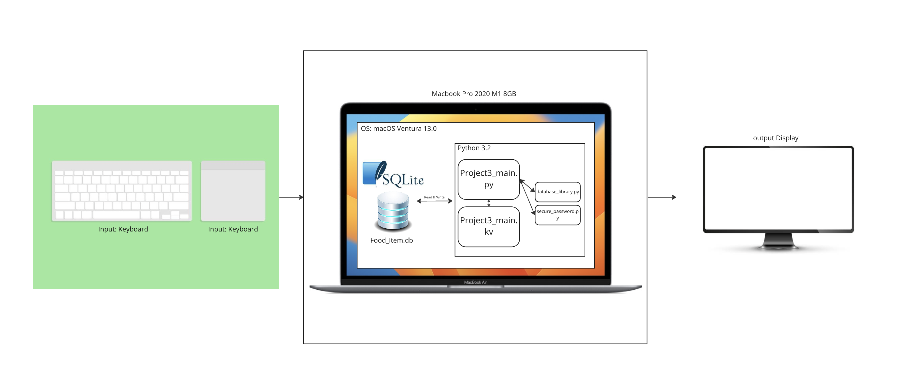
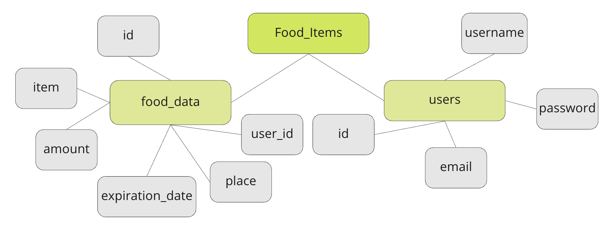
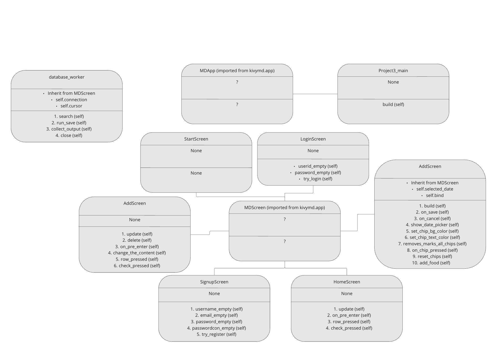
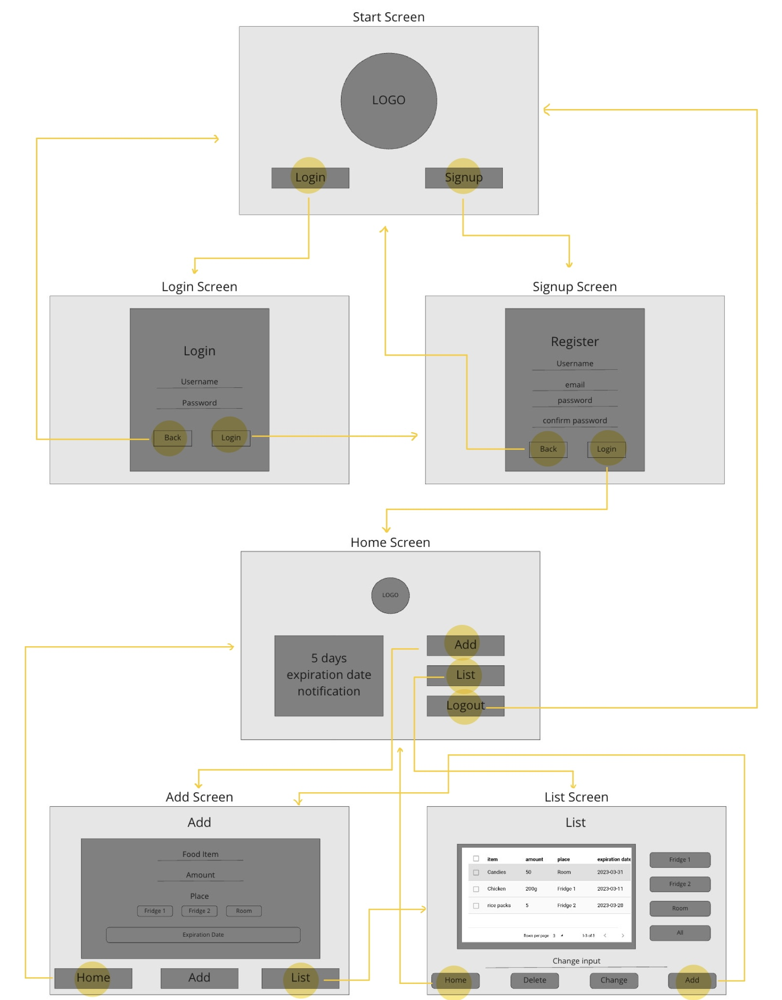
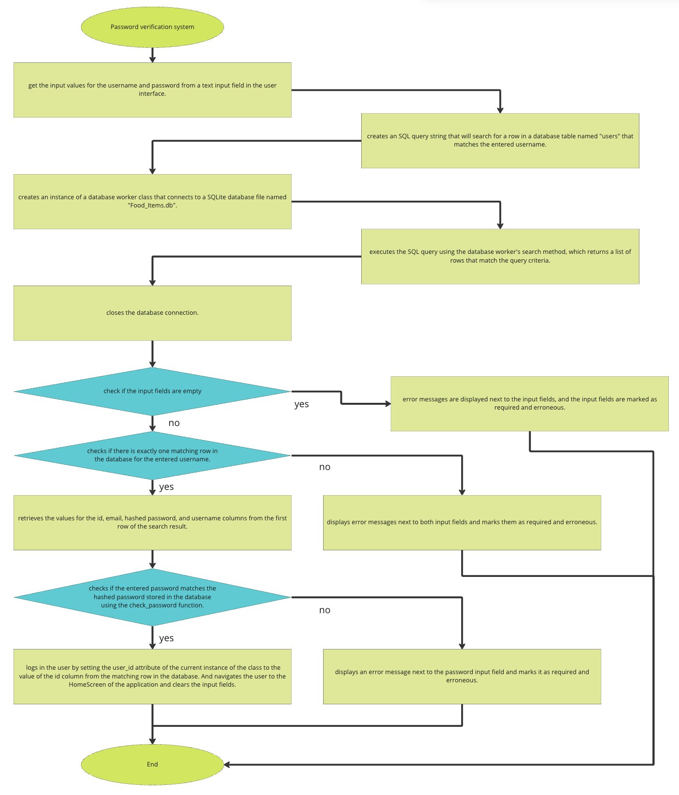
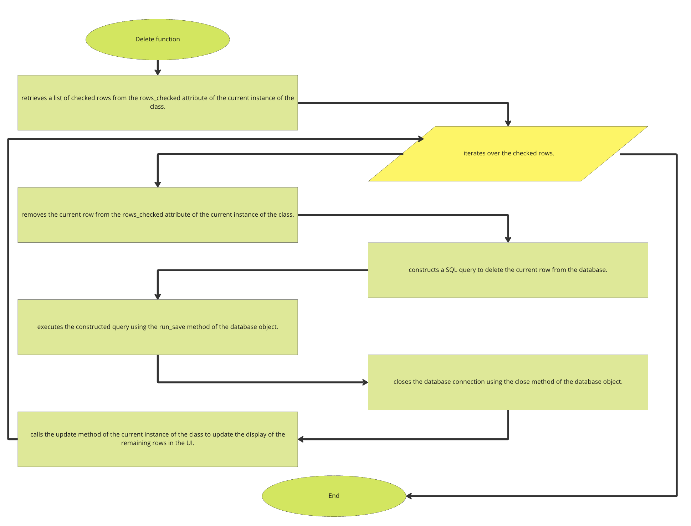
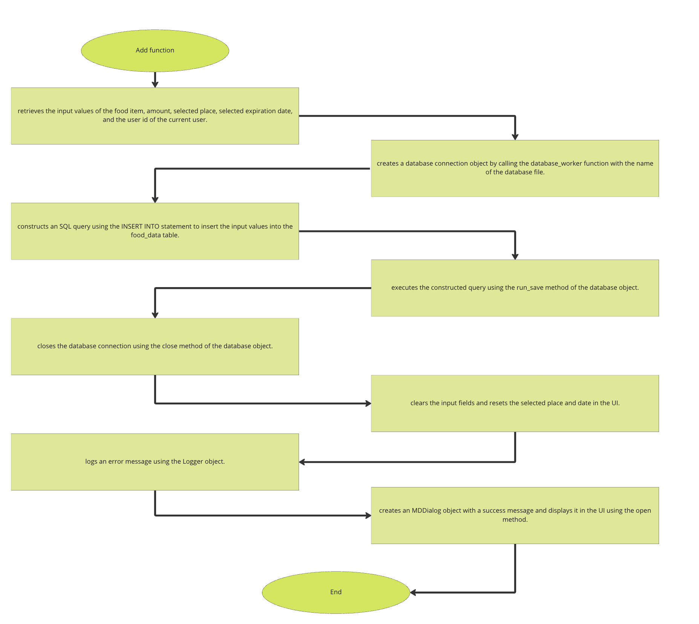

# Unit 3 Project: "LISTMATE" cooking ingredients record app

# Criteria A: Planning

## Problem definition
Kai Eduardo Suzuki is a G11 student at UWC ISAK Japan. He cooks a lot, but finds it difficult to keep track of all the ingredients he has. This is because he loses track of where each ingredient is kept in his fridge and in his room. Also, he cannot keep track of the expiry dates of all the ingredients, so sometimes he finds himself not being able to eat them anymore. Therefore, I would like to create an application on my computer that allows me to keep track of where each ingredient is stored and when its expiry date is. The application also needs a login system, as several people may use this application and we want to keep track of progress accordingly.

## Proposed Solution
Considering the client's requirements, a suitable solution would include a localised computer programme with a graphical user interface (GUI) that can store data in a database. The database is SQLite, an embedded serverless relational database, so both the programme and the database can be localised.ORM is a database abstraction layer that intervenes between the code and the database engine simplifies queries and makes the code more concise; for the GUI, we use KivyMD, which is elegant and simple. This GUI framework is structured in an object-oriented format to facilitate development.


### Design Statement ### 
I will design a Python application that runs on the KivyMD GUI framework and stores data in an SQLite database for Kai Eduardo Suzuki. The application allows him to put food that he bought into the database as input, allows him to see the list of the food and its expiration date, and allows him to edit the amount or delete the food. The application is protected by a hashed login system, which allows users to manage their progress individually and privately. It takes approximately one month to complete and is assessed against the following criteria.


## Success Criteria ##

1. The application allow the users to add new food items with its information such as the amount of food, the place user stored it, and the expiration date of the food.
2. The application has the list on the home screen which shows the food substances with an expiry date of less than 5 days.
3. The application show the foods by locations (fridge1, fridge2, room).
4. The application has the ability that users can make a change in the amount of food on the list when they use some of the food ingredients.
5. The application has a secure login and registration system.
6. The application allow the user to delete the food items if they have added to the list by mistake.


# Criteria B: Design
## System Diagram

Fig.1 System diagram of the LISTMATE

## Data Storage

Fig.2 diagram the shows the structure of database of LISTMATE

## UML Diagram

Fig.3 UML diagram of LISTMATE. This diagram depicts the classes of the application.

## Wireframe

Fig.4 Wireframe of the LISTMATE.

## Record of Tasks

| Task No | Planned Action                                           | Planned Outcome                                                                                                                    | Time estimate | Target completion date | Criterion |
|---------|----------------------------------------------------------|------------------------------------------------------------------------------------------------------------------------------------|---------------|------------------------|-----------|
| 1       | Have a meeting with client          | understand the requirements and be prepared for starting the project                                                                                        | 10 min         | Feb 7                  | A         |
| 2       | Write the problem definition and proposal solution          | understand the situation of client and organize my tasks                                                                           | 30 min          | Feb 8                 | A         |
| 3       | Write the success criteria                               | To define what I have to do for my client                                                                           | 5 min          | Feb 14                | A         |
| 4       | Meet the client and show him the success criteria                    | Ask him to give me a signiture on the success criteria paper                                                                                                           | 10 min         | Feb 16                 | A         |
| 5       | Creating Wireframe                                       | To have Wireframe diagram finished and get a visual image of the service                                                                                             |   30min       |     Feb 21          |   B    |
| 6       | Start working on the python and kyvyMD                     | To have the basic foundation of the code                                                                                          | 1hr         | Feb 23                  | C         |
| 7       | Code the login function                    | To have a login system with the userid and hashed password.                                                                                       | 1hrmin         | Feb 23                 | C         |
| 8       | Code the signup function                                                           | To have a signup system.                                           | 1hrmin         | Feb 23                 | C         |
| 9       | Create the main database of the project                                | To have the main database which is going to be a foundation of the service                                                                             | 15 min        | Feb 23                  | C         |
| 10       | Code the home screen                    | To have a asethetic homepage of the service.                                                                                       | 30rmin         | Feb 25                 | C         |
| 11       | Code the add function                    | To have a add screen which is easy to use.                                                                                       | 1 hr         | Feb 25                 | C         |
| 12       | Code the list function                    | To have a list screen which is easy to use.                                                                                       | 1 hr         | Feb 25                 | C         |
| 13      | Add the table on List screen                   | make user be able to use and see the table from the screen.                                                  | 1 hr        | Feb 28                | C         |
| 14      | Code the delete function                               | To make the function to remove food from the database                                                                   | 1hr         | Feb 28                  | C         |
| 15      | Code the 5 days expiration date notification table on HomeScreen       | Make user be able to reseive the notification                                                       | 30 min        | Feb 28                  | C         |
| 16      | Code the update function               | To make the function to update the food to the database                                                              | 30 min        | Mar 2                  | C         |
| 17      | Code the calender system on the AddScreen | make users be able to add the expiration date easier.                                   | 1 hr        | Mar 4                  | C         |
| 18      | Code the button(place) on the AddScreen | make users be able to add the place they stored date easier.                                   | 1 hr        | Mar 4                  | C 
| 19      | Code the change button                       | make users be able to change the amount of the food when they eat.                                                                                      | 1hr         | Mar 5                  | C         |
| 20      | Code the validation for Login system                          | To notice the users if there are some mistakes on userid or password                                                      | 1hr        | Mar 5                  | C         |
| 21      | Code the validation for Signup system                          | To notice the users if there are already same userid on the database and email                                                      | 1hr        | Mar 5                  | C         |
| 22      | Creating System Diagram                                  | To explain how the system works                                                                                                   | 30 min        | Mar 7                  | B         |
| 23      | Creating UML Diagram                                     | To explain about the class and function                                                                                                   | 30 min        | Mar 7                  | B         |
| 24      | Creating ER Diagram                                      | To explain how the database works                                                                                                    | 30 min        | Mar 7                  | B         |
| 25      | Creating Flow Diagrams                                   | To explain some codes that I worked on                                                                                                | 30 min        | Mar 7                  | B         |
| 26      | Completing Development Part of Criteria C                | To explain all the codes that I worked on                                                                           | 3 hr          | Mar 8                  | C         |
| 27     | Finish video for Criteria D                              | To show the result of the application that I made                               | 10 min        | Mar 9                  | D         |


## Flow Diagrams
**Password Verification System**

Fig.5 Flow diagram of a Password verification system.

**Delete Function**

Fig.6 Flow diagram of Delete function.

**Add Function**

Fig.7 Flow diagram of Add function.


## Test Plan ##
| Type                | Description                 | Process                                                                                                                                                                                                                                                                                      | Anticipated Outcome                                                                                                                                                                                                                                                                                                                                                                                                                                                               |
|---------------------|-----------------------------|----------------------------------------------------------------------------------------------------------------------------------------------------------------------------------------------------------------------------------------------------------------------------------------------|-----------------------------------------------------------------------------------------------------------------------------------------------------------------------------------------------------------------------------------------------------------------------------------------------------------------------------------------------------------------------------------------------------------------------------------------------------------------------------------|
| Unit Testing        | User Registration           | 1. Run project3_main.py <br />2. Click the Signup button on the StartScreen <br />3. Input the certain information(username, email, password, Confirm password) in each textfield<br /> 4. Click Register                                                                                         | After clicking the register button, if all text fields are blank, the text fields turn red to inform the user that input is required. If the username already exists, the user is informed of this fact and told that they need to change it to another username. If the email was not formatted correctly, the user is asked to rewrite the email. They are then asked to reconfirm their password and confirmation password if they do not match. When all text fields meet the criteria, the user can proceed to the LoginScreen. |
| Unit Testing        | User Login                  | 1. Run project3_main.py <br />2. Click the Login button on the LoginScreen <br /> Input the certain information(username,and password) in each textfield<br /> 4. Click Login                                                                                                                                                         | After clicking the login, if all text fields are blank, the text fields turn red to inform the user that input is required. If the username does not exist, the user is informed of this fact and that they need to change it to a username that does exist. The user is then asked to reconfirm the password if it does not match. When all text fields have been met, the user can proceed to the HomeScreen.                                                                                                                                                          |
| Unit Testing        | Logout                      | 1.Click the Logout button on the HomeScreen                                                                                                                                                                                                                                                   | The app should logout immediatly and go back to the StartScreen.                                                                                                                                                                                                                                                                                                                                                                                                            |
| Integration Testing | Login and Registration and Logout   | 1. Run project3_main.py <br />2. Click the Signup button on the StartScreen<br /> 3. Input the certain information(username, email, password, Confirm password) in each textfield <br />4. Click Register and go to the LoginScreen<br />5. Input the certain information(username,and password) in each textfield  <br /> 5.Click Login   <br /> 6.Click the Logout button on the HomeScreen                    | This sequence of signing up, logging in, and logging out can proceed without error if the user follows the instructions closely.                                                                                                                                                                                                                                                                                               |
| Unit Testing        | Adding food           | 1. Run project3_main.py <br />2. Login with the userid and password <br />3. Click "Add" button on the HomeScreen <br />4. Input certain informations(fooditem, amount) on the textfields.<br />5. Click the place button(Fridge1, Fridge2, Room) <br />6. Click the "Expiration date" button and select the expiration date of the food <br />7. press "Add" button to add the food on the list                                                                                                                | If the food_item text field is empty, the text field turns red to inform the user that input is required. If the food_amount text field is empty, the text field turns red to inform the user that input is required. The food can then be added to the list by pressing the button for the place where the food is stored and selecting an expiry date.                                                                                                                                  |
| Unit Testing        | See the list         | 1. Run project3_main.py <br />2. Login with the userid and password <br />3. Click "List" button on the HomeScreen <br />4. Click the button (Fridge1, Fridge2, Room, All) to select the foods which is stored in each location <br />5. Click the check button on the list, click "Delete button" on the bottom bar<br /> 6.Click the check button on the list, click the row that you want to change, input the texts about the amount of the food, and click "Change button" on the bottom bar.                                                        | If you press the buttons (Fridge1, Fridge2, Room, All) and the food stored only in the respective location will appear in the list.                                                                                                                               |
| Unit Testing        | Deleting Vocabulary         | 1. Run project3_main.py <br />2. Login with the userid and password <br />3. Click the check button on the list<br /> 4. Click "Delete button" on the bottom bar | If no tick button on the list has been pressed, the user is informed that the tick button needs to be pressed. If more than one tick button in the list has been pressed, the user is informed that only one tick button needs to be pressed. The item is then deleted by pressing the delete button.         |
| Unit Testing        | Editing amount Vocabulary      | 1. Run project3_main.py <br />2. Login with the userid and password <br />3. Click "List" button on the HomeScreen <br />4.Click the check button on the list. <br />5.Click the row that you want to change. <br />6.input the texts about the amount of the food. <br />7.and click "Change button" on the bottom bar.                                                       | The application changes the amount of food at the moment the change button is pressed, with the text put in by the user being entered into the row chosen by the user.                                                                                                                                                                                                                                                                                |
| Integration Testing | Adding + Editing Vocabulary | 1. Run project3_main.py <br />2. Login with the userid and password <br />3. Add a food <br />4. press the "list" button to go to the ListScreen <br />5.Click the button(Fridge1, Fridge2, Room, All)to see each food.<br />6.delete the food. <br />7.change the amount of food. <br />8. Press the button "Home" to go HomeScreen                                                                                                    | If the user uses these functions in a suitable way, they can be used without any errors. By using the application you will be able to view the list, change the contents of the list, delete the contents of the list, etc.                                                                                                                                                                                                                                                                                                    |
| Code Review         | Reviewing Code              | Going through the code and making sure all the codes are working                                                                                                                                                           | If there is an error or any problems, I will fix it.                                                                                                                                                                                                                                                                                                                           |


# Criteria C: Development

## Exisisting tools

| Software/Development Tools | Coding Structure Tools       | Libraries  |
|----------------------------|------------------------------|------------|
| PyCharm                    | OOP Structures(Classes)      | Kivymd.app |
| Python                     | SQL requests                 | Passlib    |
| KivyMD                     | Databases                    | sqlalchemy |
| SQLite                     | Encryption                   | kivymd.uix |
| Github Copilot             | For Loops                    |            |
| ChatGPT                    | If-then-else statements      |            |
|                            | ORM(Object Relation Mapping) |            |

## List of techniques used

1. Object Oriented Programming(OOP)
2. Object Relation Mapping(ORM)
3. KivyMD Library
4. For loops
5. if statements
6. Hashing (password)
7. Databases

## Computational Thinking

### Decomposition
In computational thinking, decomposition refers to dividing a complex problem or system into parts that are easier to conceptualize, understand, program, and maintain. A key aspect of this project was a scoring system for storing statistics and user performance in a database. This requires multiple steps, so I split the overall action into gathering user and vocabulary information, calling another function in the database handler, and moving the GUI to the next card. This is a snippet of the add points function. 

## Development with KyvyMD

### Screen Manager
```.kv
ScreenManager:
    id:scr_manager
    StartScreen:
        name: "StartScreen"
    LoginScreen:
        name: "LoginScreen"
    SignupScreen:
        name: "SignupScreen"
    HomeScreen:
        name: "HomeScreen"
    AddScreen:
        name: "AddScreen"
    ListScreen:
        name: "ListScreen"
```
Clients need the application to record and store the food they have. To meet these expectations, they are going to use KyvyMD's ScreenManager to manage the pages of the interface they develop. The ScreenManager widget serves as the basis for the user interface of the multi-screen application. The ScreenManager is given the ID scr_manager.

The ScreenManager is responsible for managing multiple screens in the UI. In my application, six screens are defined within the ScreenManager, each with a unique name. (StartScreen, LoginScreen, SignupScreen, HomeScreen, Addscreen, ListScreen) Each screen is defined as a custom widget and is specified by its class name.

LoginScreen and SignupScreen are screens for users to authenticate and create new accounts respectively; HomeScreen acts as the main screen of the application and typically allows users to use various services. The AddScreen allows users to add new food information to their account, while the ListScreen displays a list of food items stored by the user.


### MDBoxLayout
```.kv
MDBoxLayout:
        size_hint: .7, .7
        orientation: "vertical"
        pos_hint:{"center_x":.5,"center_y":.5}
```
MDBoxLayout is a type of layout in the KivyMD library which arranges child widgets either vertically or horizontally. It is a subclass of the BoxLayout in the Kivy framework.

In this code, the MDBoxLayout is created with a size_hint of .7, .7, which means it will take up 70% of the available space in both the horizontal and vertical directions. The orientation is set to "vertical", which means the child widgets will be stacked vertically. Finally, the pos_hint sets the position of the MDBoxLayout at the center of the parent widget.

To use MDBoxLayout, you need to import it from the KivyMD library and add child widgets to it. The child widgets can be added in the kv language or in Python. You can also set the size and position of the child widgets using various properties like size_hint, size, and pos_hint.

### MDRaisedButton
```.kv
MDRaisedButton:
                id: try_login_button
                size_hint: .5, 1
                text: "Login"
                md_bg_color: "#c56e33"
                on_press: root.parent.current = "LoginScreen"
```
MDRaisedButton is a button widget in the KivyMD library that is designed to have a raised appearance. It inherits from the Button widget in the Kivy framework and adds extra styling to make it look like a raised button.

In this code, the MDRaisedButton is created with an id of try_login_button. The size_hint is set to .5, 1, which means the button will take up half of the available horizontal space and all of the available vertical space. The text property sets the text of the button to "Login". The md_bg_color sets the background color of the button to "#c56e33", which is a shade of brown. Finally, the on_press event sets the current property of the parent widget to "LoginScreen" when the button is pressed.

To use MDRaisedButton, you need to import it from the KivyMD library and create an instance of it in your code. You can then add it to your app's layout like any other widget.

### Images
```.kv
Image:
            id: logo
            size_hint: 1, 1
            source: "logo_clear.png"
            halign: "center"
            pos_hint:{"center_x":.5,"center_y":.5}
```
In KivyMD, the Image widget is used to display images in your application. It is a subclass of the AsyncImage widget in Kivy and provides additional features such as the ability to scale and align the image.

In the code, an Image widget is created with an id of logo. The size_hint is set to 1, 1, which means the image will take up all available space. The source property sets the path to the image file that will be displayed. The halign property sets the horizontal alignment of the image to the center, and the pos_hint property centers the image in its parent widget.

To use Image in your KivyMD app, you first need to import it from the KivyMD library. Then, you can create an instance of it and set its properties, just like any other widget.


### MDCard
```.kv
MDCard:
        size_hint: 0.5, .9
        elevation: 2
        orientation: "vertical"
        pos_hint: {"center_x": .5, "center_y": .5}
        padding: dp(50)
```
MDCard is a widget in the KivyMD library that provides a Material Design card component. The card is typically used to group related information and actions together in a user interface.

The widget has several properties that can be customized, such as size_hint, which determines the size of the card relative to its parent widget, and pos_hint, which specifies the card's position relative to its parent widget using a dictionary of normalized position values. The elevation property sets the visual depth of the card, with higher values creating a stronger drop shadow effect. The padding property determines the amount of space between the edge of the card and its contents.

The orientation property sets the layout orientation of the card's contents. By default, it is set to "vertical", which means that the contents will be arranged vertically from top to bottom. However, it can also be set to "horizontal" to arrange the contents horizontally from left to right.

To use MDCard in your KivyMD app, you need to import it from the KivyMD library and create an instance of it, setting its properties as desired. You can then add the card to your app's user interface hierarchy, typically inside a container widget like a BoxLayout or GridLayout.

### MDlabel
```.kv
MDLabel:
                text: "Place"
                font_size: 40
                size_hint: .6, .05
                pos_hint: {"center_x": .5, "center_y": .5}
```
MDLabel is a widget in the KivyMD library that displays text in a user interface. It is similar to the standard Kivy Label widget, but provides additional features and styling options specific to the Material Design language.

The widget has several properties that can be customized, such as text, which sets the label's text content, and font_size, which sets the size of the text. Other properties include size_hint, which determines the size of the label relative to its parent widget, and pos_hint, which specifies the label's position relative to its parent widget using a dictionary of normalized position values.

To use MDLabel in your KivyMD app, you need to import it from the KivyMD library and create an instance of it, setting its properties as desired. You can then add the label to your app's user interface hierarchy, typically inside a container widget like a BoxLayout or GridLayout.

In this code, text is set to "Place", font_size is set to 40, size_hint is set to .6 for width and .05 for height, and pos_hint is set to center the label horizontally and vertically within its parent widget. These settings are specific to the example code and can be adjusted to suit the needs of your app.

### MDtextfield
```.kv
MDTextField:
            id: login_userid_input
            hint_text: "Enter your username or email"
            icon_left: "email"
            size_hint: 1, .1
            helper_text_mode: "on_error"
            on_text: root.userid_empty()
            helper_text: ""
            required: False
```
MDTextField is a widget in the KivyMD library that allows users to input text. It is similar to the standard TextInput widget in Kivy, but has additional features and styling options. The widget has several properties that can be customized, such as hint_text, which displays a hint to the user when the field is empty, and icon_left and icon_right, which allow you to add icons to the left or right side of the text field.

Other properties include size_hint, which determines the size of the field relative to its parent widget, and helper_text_mode, which controls when helper text is displayed. on_text is a method that is called whenever the text in the field changes, while helper_text can be used to display additional text alongside the main text field, such as an error message or instructions for the user.

Finally, required is a boolean property that determines whether the field is required to be filled in by the user. To use MDTextField in your KivyMD app, you need to import it from the KivyMD library and create an instance of it, setting its properties as desired.

### MDChip
```.kv
MDChip:
                    text: "Room"
                    icon_left: "bed-outline"
                    size_hint: .3, .8
                    on_press: root.on_chip_pressed(self)
                    on_active: if self.active: root.removes_marks_all_chips(self)
```
MDChip is a widget in the KivyMD library that displays information in a compact, clickable format. It is often used to display tags or categories that users can select or interact with. The widget has several properties that can be customized, such as text, which displays the main text of the chip, and icon_left and icon_right, which allow you to add icons to the left or right side of the chip.

Other properties include size_hint, which determines the size of the chip relative to its parent widget, and on_press, which is a method that is called when the chip is clicked. The on_active property can be used to specify a method that is called when the chip's state changes, such as when it is selected or deselected.

In this code, on_chip_pressed and removes_marks_all_chips are methods defined in the parent widget that are called when the chip is pressed or its state changes, respectively. These methods can be used to update the state of the app or perform other actions based on the user's interaction with the chip.

To use MDChip in your KivyMD app, you need to import it from the KivyMD library and create an instance of it, setting its properties as desired. You can then add the chip to your app's user interface hierarchy, typically inside a container widget like a BoxLayout or GridLayout.


## Development using python

### database worker
```.py
class database_worker:
    def __init__(self, name):
        self.connection = sqlite3.connect(name)
        self.cursor = self.connection.cursor()

    def search(self, query):
        result = self.cursor.execute(query).fetchall()
        return result

    def run_save(self, query):
        self.cursor.execute(query)
        self.connection.commit()
        return

    def collect_output(self,query):
        self.cursor.execute(query)
        return self.cursor.fetchone()

    def close(self):
        self.connection.close()
```
This is a Python class named "database_worker" that encapsulates methods for performing basic database operations using SQLite.

The constructor method "init" takes a parameter "name" which is the name of the SQLite database to be connected. It initializes the class variables "connection" and "cursor" to store the database connection and cursor objects respectively.
The "search" method takes a parameter "query" which is a SQL query to be executed against the database. It uses the cursor object to execute the query and fetch all the results which are then returned.
The "run_save" method takes a parameter "query" which is a SQL query to be executed against the database. It uses the cursor object to execute the query and then commits the changes made to the database.
The "collect_output" method takes a parameter "query" which is a SQL query to be executed against the database. It uses the cursor object to execute the query and fetch the first result which is then returned.
The "close" method is used to close the database connection.

Overall, this code provides a basic interface to interact with an SQLite database and perform operations such as searching, saving, and retrieving data.


### login system

#### Validation
```.py
    def userid_empty(self):
        input1 = self.ids.login_userid_input.text
        if input1 == "":
            self.ids.login_userid_input.helper_text_mode = "on_error"
            self.ids.login_userid_input.helper_text = "Username is required"
            self.ids.login_userid_input.required = True

    def password_empty(self):
        input2 = self.ids.login_password_input.text
        if input2 == "":
            self.ids.login_password_input.helper_text_mode = "on_error"
            self.ids.login_password_input.helper_text = "password is required"
            self.ids.login_password_input.required = True
```
This code defines two methods "userid_empty" and "password_empty" that are used to validate user inputs for a login screen in a GUI application.

The "userid_empty" method checks if the input for the user ID is empty or not. If the input is empty, it sets the helper text mode of the login_userid_input field to "on_error" and displays an error message indicating that the username is required. It also sets the "required" attribute of the login_userid_input field to true, indicating that the user must enter a value in this field before they can proceed.
The "password_empty" method checks exactly same things and show users a same things.

Overall, these methods provide a basic input validation mechanism for ensuring that the user enters valid input for the login credentials. This helps to prevent errors and improve the user experience by providing clear feedback when inputs are missing or invalid.

#### input(password) = hash(password)
```.py
    def try_login(self):
        uname = self.ids.login_userid_input.text
        passwd = self.ids.login_password_input.text
        query = f"SELECT * from users WHERE username = '{uname}'"
        db = database_worker("Food_Items.db")
        result = db.search(query=query)
        db.close()

        input1 = self.ids.login_userid_input.text
        input2 = self.ids.login_password_input.text
        if input1 == "" and input2 == "":
            self.ids.login_userid_input.helper_text_mode = "on_error"
            self.ids.login_userid_input.helper_text = "Username or email is required"
            self.ids.login_userid_input.required = True
            self.ids.login_userid_input.error = True
            self.ids.login_password_input.helper_text_mode = "on_error"
            self.ids.login_password_input.helper_text = "password is required"
            self.ids.login_password_input.required = True
            self.ids.login_password_input.error = True

        else:
            if len(result) == 1:
                id, email, hashed, uname = result[0]
                self.user_id = id
                if check_password(user_password=passwd, hashed_password=hashed):
                    print("Login Successful")
                    self.parent.current = "HomeScreen"
                    self.ids.login_userid_input.text = ''
                    self.ids.login_password_input.text = ''
                    self.ids.login_userid_input.required = False
                    self.ids.login_password_input.required = False
                else:
                    self.ids.login_password_input.helper_text_mode = "on_error"
                    self.ids.login_password_input.helper_text = "Incorrect password"
                    self.ids.login_password_input.required = True
                    self.ids.login_password_input.error = True
            else:
                self.ids.login_userid_input.helper_text_mode = "on_error"
                self.ids.login_userid_input.helper_text = "user doesn't exist"
                self.ids.login_userid_input.required = True
                self.ids.login_userid_input.error = True
                self.ids.login_password_input.helper_text_mode = "on_error"
                self.ids.login_password_input.helper_text = "fix the username first"
                self.ids.login_password_input.required = True
                self.ids.login_password_input.error = True
```
This code defines the method 'try_login', which is used to authenticate a user based on the login information entered in the GUI application.

The method first retrieves the values of the username and password fields from the GUI and builds a query to search for matching user records in the database. The query is executed using the "database_worker" object used to search for records in the database and the results are stored in a variable named "result".

If both the username and password fields are empty, an error message is displayed on the GUI indicating that these fields are required. If a user record is found in the database, the password entered by the user is compared with the hashed password retrieved from the database. If the passwords match, the user successfully logs in and the GUI is redirected to the home screen. If not, an error message is displayed indicating that the entered password is incorrect.

If there is no user record in the database corresponding to the username entered, an error message is displayed indicating that the user does not exist and the user is asked to correct the username before retrying to log in.

### Registration System
```.py
    def try_register(self):
        uname = self.ids.uname_reg.text
        email = self.ids.email_reg.text
        passwd = self.ids.password_reg.text
        passwd2 = self.ids.passwordcon_reg.text
        email_pattern = r"[^@]+@[^@]+\.[^@]+"
        db = database_worker("Food_Items.db")
        query = f"""SELECT COUNT(*) FROM users WHERE username = '{uname}';"""
        temp = db.collect_output(query)
        print(temp)
        temp = temp[0]
```
This code defines a method "try_register" that is used to register a new user in a GUI application.

The method first retrieves the values of the username, email, password, and confirm password fields from the GUI. It then defines a regular expression pattern for email validation and creates a "database_worker" object to interact with the database.

Next, a query is constructed to count the number of users with the same username as the one entered by the user. The query is executed using the "database_worker" object and the result is stored in a variable named "temp". The "temp" variable contains the count of user records with the same username, which is then printed to the console.

Finally, the first element of the "temp" variable is extracted and stored in "temp" itself. 

Additionally, I also have a validation in the registration methods to make it easier for users to use the application when they want to register to this app.


### Adding fooditem System

#### Datepicker
```.py
    def build(self):
        self.theme_cls.theme_style = "Dark"
        self.theme_cls.primary_palette = "Orange"

        return (
            MDScreen(
                MDRaisedButton(
                    text="Open data picker",
                    pos_hint={'center_x': .5, 'center_y': .5},
                    on_release=self.show_date_picker,
                )
            )
        )

    def on_save(self, instance, value, date_range):
        '''
        Events called when the "OK" dialog box button is clicked.

        :type instance: <kivymd.uix.picker.MDDatePicker object>;

        :param value: selected date;
        :type value: <class 'datetime.date'>;

        :param date_range: list of 'datetime.date' objects in the selected range;
        :type date_range: <class 'list'>;
        '''

        self.selected_date = value
        self.ids.expiration_date_button.text = str(value)

    def on_cancel(self, instance, value):
        '''Events called when the "CANCEL" dialog box button is clicked.'''

    def show_date_picker(self, *args):
        date_dialog = MDDatePicker(primary_color='#c56e33',accent_color="c56e33", selector_color="white",)
        date_dialog.bind(on_save=self.on_save, on_cancel=self.on_cancel)
        date_dialog.open()
```
This is a KivyMD screen that displays a button that when clicked, opens a date picker dialog box. The date picker allows the user to select a date and returns the selected date. The selected date is then displayed on the button. The build() method sets the theme style and primary color palette, and returns the screen with a button. The on_save() method is called when the user clicks the "OK" button on the date picker dialog box and sets the selected date to the selected_date attribute of the class. The on_cancel() method is called when the user clicks the "CANCEL" button on the date picker dialog box. The show_date_picker() method creates an instance of the MDDatePicker class and opens the date picker dialog box.

#### Chip
```.py
    def set_chip_bg_color(self, active_value: int):
        '''
        Will be called every time the chip is activated/deactivated.
        Sets the background color of the chip.
        '''
        self.active = bool(active_value)
        self.md_bg_color = (
            (0, 0, 0, 0.4)
            if self.active
            else (
                self.theme_cls.bg_darkest
                if self.theme_cls.theme_style == "Light"
                else (
                    self.theme_cls.bg_light
                    if not self.disabled
                    else self.theme_cls.disabled_hint_text_color
                )
            )
        )
        if self.active:
            self.ids.chip_button.background_color = self.theme_cls.primary_dark
        else:
            self.ids.chip_button.background_color = self.theme_cls.bg_light

    def set_chip_text_color(self, instance_chip, active_value: int):
        print("set_chip_text_color called")
        Animation(
            color=(0, 0, 0, 1) if self.active else (0, 0, 0, 0.5), d=0.2
        ).start(self.ids.label)

    def removes_marks_all_chips(self, selected_instance_chip):
        for instance_chip in self.ids.chip_box.children:
            if instance_chip != selected_instance_chip:
                instance_chip.active = False

    def on_chip_pressed(self, instance_chip):
        # Set the selected place and remove marks from all other chips
        self.selected_place = instance_chip.text
        for child in self.ids.chip_box.children:
            if child != instance_chip:
                child.active = False

        # Add a checkmark to the selected chip
        instance_chip.icon = "check"
        instance_chip.icon_color = (1, 1, 1, 1)  # white

    def build(self):
        return Builder.load_string()

    def reset_chips(self):
        for chip in self.ids.chip_box.children:
            chip.active = False
```

I used this code as buttons that we can use when we choose the place where we want to store our food. Three buttons are Fridge 1, Fridge 2, and Room since client has two fridges in his house. This code defines methods for a custom widget that contains multiple chips. The set_chip_bg_color method sets the background color of the chip based on its activation state. The set_chip_text_color method animates the text color of the chip label. The removes_marks_all_chips method unchecks all chips except the selected one. The on_chip_pressed method handles chip selection and adds a checkmark to the selected chip. The reset_chips method unchecks all chips. The build method loads the widget layout.

#### Adding the food
```.py
    def add_food(self):
        items = self.ids.add_fooditems_input.text.strip()
        amount = self.ids.add_amount_input.text.strip()
        place = self.selected_place


        expiration_date = str(self.selected_date)

        user_id = self.manager.get_screen("LoginScreen").user_id

        db = database_worker("Food_Items.db")
        add_food = f"INSERT into food_data (user_id, item, amount, place, expiration_date) values ('{user_id}','{items}','{amount}','{place}','{expiration_date}')"
        db.run_save(add_food)
        db.close()
        self.ids.add_fooditems_input.text =  ''
        self.ids.add_amount_input.text = ''
        self.ids.expiration_date_button.text = 'Expiration date'
        self.reset_chips()

        Logger.error("Food is added")
        dialog = MDDialog(
            title="Food is ADDED!!",
            text=" ",
            size_hint=(0.7, 0.3),
        )
        dialog.open()
```

This code defines a method add_food that gets the input data for a new food item from a KivyMD screen and inserts it into a SQLite database named Food_Items.db. The method first retrieves the values of items, amount, and place input fields, and the selected date from a date picker. It then uses the user_id of the logged-in user to insert the data into the food_data table in the database. After the data has been added, the input fields and the selected date are reset to their default values, and a dialog box is displayed to confirm that the food item has been added successfully. The Logger module is used to log an error message when the food is added.

### List (delete & change) system

#### delete system
```.py
    def delete(self):
        rows_checked = self.rows_checked
        print(f"haha {rows_checked}")
        if len(rows_checked) == 1:
            for r in rows_checked:
                db = database_worker("Food_Items.db")
                print(r)
                self.rows_checked.remove(r)
                query = f"""delete from food_data where item = "{str(r[0])}" and amount = "{str(r[1])}" and place = "{str(r[2])}" and expiration_date = "{str(r[3])}" """
                print(query)
                db.run_save(query)
                db.close()
                self.update()
        else:
            Logger.error("Please select one item to delete")
            dialog = MDDialog(
                title="Warning",
                text="Please select one item to edit",
                size_hint=(0.7, 0.3)
            )
            dialog.open()
```
This code defines a function called delete() that handles the deletion of selected rows from a database. The function first checks if exactly one row is selected, and if so, it retrieves the data from the selected row and constructs a SQL query to delete the corresponding record from the database. The query is then executed and the GUI is updated to reflect the changes. If more than one row is selected, an error message is displayed to the user.


#### change system
```.py
    def change_the_content(self):
        checked = self.rows_checked
        if len(checked) == 1:
            rows_checked = self.rows_checked[0]
            user_id = self.manager.get_screen("LoginScreen").user_id
            # print(rows_checked)
            column_index = rows_checked.index(str(self.column))
            # print(column_index)
            query = f"""select id from food_data 
            WHERE user_id = {user_id} and 
            item = "{rows_checked[0]}" and 
            amount = "{rows_checked[1]}" and 
            place = "{rows_checked[2]}" and 
            expiration_date = "{rows_checked[3]}"
            """
            query = str(query)
            # print(query)
            db = database_worker("Food_Items.db")
            temp_id = db.collect_output(query)
            choice = ["item","amount","place","expiration_date"]
            # print(choice[column_index])
            # print(self.ids.list_change_input.text)
            query2 = f"""update food_data set {choice[column_index]} = {self.ids.list_change_input.text} where  id = {temp_id[0]}"""
            # print(query2)
            db.run_save(query2)
            db.close()
            self.rows_checked.remove(rows_checked)
            self.update()
            print(self.data_table.get_row_checks())
        else:
            Logger.error("Please select only one item to edit")
            dialog = MDDialog(
                title="Warning",
                text="Please select only one item to edit",
                size_hint=(0.7, 0.3)
            )
            dialog.open()
```

The change_the_content() function updates the value of a selected cell in the data table. The function checks if only one cell is selected, and then retrieves the cell's information from the database using a SELECT query with the user ID and the cell values. It then determines which column was selected and updates the value in the corresponding row of the table using an UPDATE query. Finally, the function removes the cell's selection and updates the table. If more than one cell is selected, an error message is displayed.

#### The list on the screen (how to show the database on the KyvyMD screen)
```.py
    def on_pre_enter(self, *args):
        self.data_table = MDDataTable(
            size_hint=(.675, .52),
            pos_hint={"center_x": .389, "center_y": .5},
            use_pagination=True,
            check=True,
            column_data=[("item", 70),
                         ("amount", 40),
                         ("place", 50),
                         ("expiration date", 60)
                         ]
        )
        # add the table to the screen
        self.data_table.bind(on_row_press=self.row_pressed)
        self.data_table.bind(on_check_press=self.check_pressed)
        self.add_widget(self.data_table)
        self.update()

    def row_pressed(self,table,row):
        print("a row was pressed", row.text)
        self.column = row.text
        row.md_bg_color = "#c56e33"

    def check_pressed(self, table, current_row):
        print("a check was pressed", current_row)
        if  current_row not in self.rows_checked:
            self.rows_checked.append(current_row)
        else:
            self.rows_checked.remove(current_row)
        print(self.rows_checked)
```
This code defines a function on_pre_enter which creates an instance of MDDataTable and adds it to the screen. The MDDataTable is a table widget provided by the KivyMD library. The table has four columns, each with a header: "item", "amount", "place", and "expiration date". The table is set to use pagination and has a checkbox column enabled. The on_row_press and on_check_press events are bound to their respective callback functions row_pressed and check_pressed. Finally, the update function is called to populate the table with data from the database.

#### update system
```.py
    def update(self, location="%"):
        self.data_table.row_data.clear( )
        user_id = self.manager.get_screen("LoginScreen").user_id
        db = database_worker("food_items.db")
        query = f"SELECT item,amount,place,expiration_date FROM food_data where user_id = {user_id} and place like '{location}'"
        print(query)
        data = db.search(query)
        db.close()
        if len(data)==0:
            data = [["","", "", "", ""]]
        for row in data:
            if row not in self.data_table.row_data:
                self.data_table.row_data.append(row)
```
This code defines a method called update that updates the data shown in a MDDataTable widget based on a specified location. It first clears the current data in the widget and gets the user_id from the LoginScreen using self.manager.get_screen. It then creates a database connection and runs a query to select all items that belong to the specified user and are located at the specified location. The method then iterates over the results and appends them to the row_data attribute of the MDDataTable widget. If there are no results, it adds a single empty row to the table.


# Criteria D: Functionality

## The video that shows my work

## Citations

## Appendix
