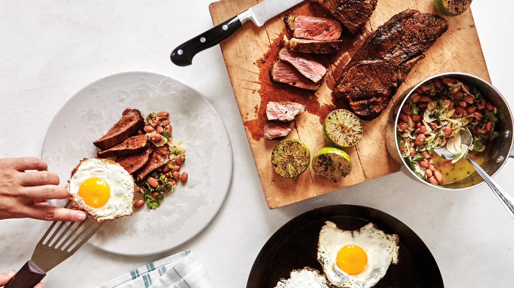

# Unit 3 Project: "LISTMATE" cooking ingredients record app

# Criteria A: Planning

## Problem definition
Kai Eduardo Suzuki is a G11 student at UWC ISAK Japan. He cooks a lot, but finds it difficult to keep track of all the ingredients he has. This is because he loses track of where each ingredient is kept in his fridge and in his room. Also, he cannot keep track of the expiry dates of all the ingredients, so sometimes he finds himself not being able to eat them anymore. Therefore, I would like to create an application on my computer that allows me to keep track of where each ingredient is stored and when its expiry date is. The application also needs a login system, as several people may use this application and we want to keep track of progress accordingly.

## Proposed Solution
Considering the client's requirements, a suitable solution would include a localised computer programme with a graphical user interface (GUI) that can store data in a database. The database is SQLite, an embedded serverless relational database, so both the programme and the database can be localised.ORM is a database abstraction layer that intervenes between the code and the database engine simplifies queries and makes the code more concise; for the GUI, we use KivyMD, which is elegant and simple. This GUI framework is structured in an object-oriented format to facilitate development.

### Design Statement ### 
I will design a Python application that runs on the KivyMD GUI framework and stores data in an SQLite database for Kai Eduardo Suzuki. The application allows him to put food that he bought into the database as input, allows him to see the list of the food and its expiration date, and allows him to edit the amount or delete the food. The application is protected by a hashed login system, which allows users to manage their progress individually and privately. It takes approximately one month to complete and is assessed against the following criteria.

## Success Criteria ##

1. The application allow the users to add new food items with its information such as the amount of food, the place user stored it, and the expiration date of the food.
2. The application has the list on the home screen which shows the food substances with an expiry date of less than 5 days.
3. The application show the foods by locations (fridge1, fridge2, room).
4. The application has the ability that users can make a change in the amount of food on the list when they use some of the food ingredients.
5. The application has a secure login and registration system.
6. The application allow the user to delete the food items if they have added to the list by mistake.

# Criteria B: Design
## System Diagram

Fig.1 System diagram of the LISTMATE

## Data Storage

Fig.2 diagram the shows the structure of database of LISTMATE

## UML Diagram

Fig.3 UML diagram of LISTMATE. This diagram depicts the classes of the application.

## Wireframe

Fig.4 Wireframe of the LISTMATE.

