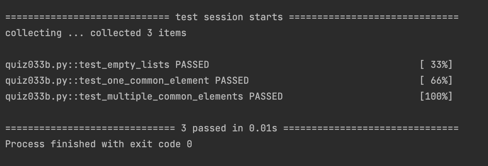

# Quiz33

## Code
```.py
def mystery(list1:list, list2:list):
    x = []
    for a in range(len(list1)):
        for b in range(len(list2)):
            if list1[a] == list2[b]:
                x.append(list1[a])
    return x
```

## Result

