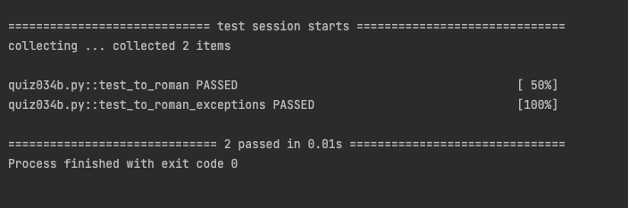

# Quiz 34

## Code
```.py
def to_roman(input:int)->str:
    if input > 100:
        raise ValueError("Input must me less than or equal to 100")
    #Convert int to roman inputber
    roman = ""
    if input == 100:
        roman = "C"
        input = 0
    if input >= 90:
        roman += "XC"
        input -= 90
    if input >= 50:
        roman += "L"
        input -= 50
    if input >= 40:
        roman += "XL"
        input -= 40
    if input >= 10:
        roman += "X" * (input // 10)
        input %= 10
    if input >= 9:
        roman += "IX"
        input -= 9
    if input >= 5:
        roman += "V"
        input -= 5
    if input >= 4:
        roman += "IV"
        input -= 4
    if input >= 1:
        roman += "I" * input
    return roman
```

## Result

