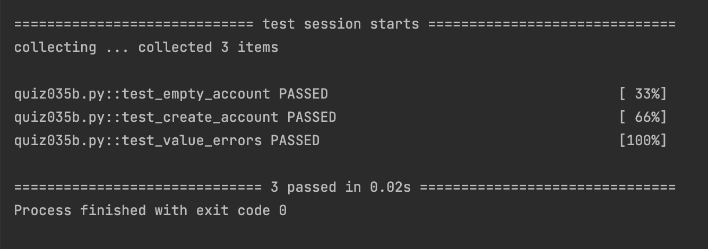

# Quiz 35

## Code

```.py
import random


class Account:
    def __init__(self):
        self.balance = 0
        self.holder_name = ""
        self.holder_email = ""
        A = random.randint(100,999)
        B = random.randint(10000,99999)
        C = random.randint(0,9)
        self.number = [f"{A}-{B}-{C}"]

    def get_account_no(self):
        return self.number[0]

    def set_holder_name(self,name):
        if not isinstance(name, str):
            raise ValueError("Name must be a string")
        self.holder_name = name
        res = f"Holder's name set to {self.holder_name}"
        return res

    def set_holder_email(self,email):
        self.holder_email = email
        res = f"Holder's email set to {self.holder_email}"
        return res

    def deposit(self,amount:int):
        self.balance += amount
        res = f"New balance: {self.balance} USD"
        return res

    def get_balance(self):
        return self.balance
```

## Result

