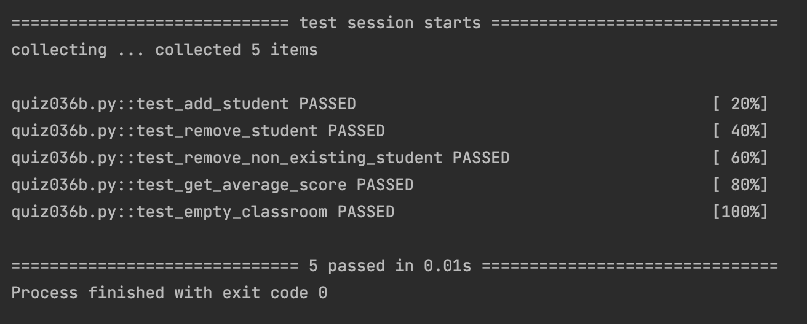

# Quiz 36

## Code
```.py
class Person:
    def __init__(self, name, age):
        self.name = name
        self.age = age
    def get_name(self)->str:
        return self.name()
    def get_age(self)->int:
        return self.age

class Student(Person):
    def __init__(self, name:str, age:int, grade:int):
        super().__init__(name=name, age=age)
        self.grade=grade
        self.name=name
        self.age=age
    def get_grade(self)->int:
        return self.grade

class Classroom():
    def __init__(self):
        self.students = []

    def add_student(self,student:Student):
        self.students.append(student)

    def remove_student(self,student:Student):
        if student not in self.students:
            raise ValueError("Student not in classroom")
        self.students.remove(student)

    def get_average_score(self):
        if len(self.students) == 0:
            raise ValueError("Classroom is empty")
        x = 0
        for i in self.students:
            x += i.get_grade()
        return x/len(self.students)
```

## Result


## UML Diagram

