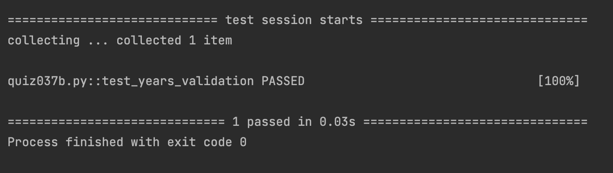

# Quiz 37

## Code
```.py


class CompoundInterest:
    def __init__(self, principal, rate,years):
        self.principal = principal
        self.rate = rate
        self.years = years

class AccountingProgram:
    def __init__(self):
        self.compound = CompoundInterest(0,0,0)
    def set_principal(self, pri):
        if pri <= 0:
            raise ValueError("Principal should be greater than zero")
        self.compound.principal = pri
        return f"Principal set to {self.compound.principal}"

    def set_rate(self, r):
        if r <= 0:
            raise ValueError("Interest rate should be greater than zero")
        self.compound.rate = r
        return f"Rate set to {self.compound.rate}"

    def set_years(self, y):
        if y <= 0:
            raise ValueError("Years should be greater than zero")
        self.compound.year = y
        return f"Year set to {self.compound.year}"

    def calculate_interest(self):
        res = self.compound.principal*(1+self.compound.rate)**self.compound.year
        xx = "{:.2f}".format(res)
        return float(xx)
```

## Result



## UML Diagram

