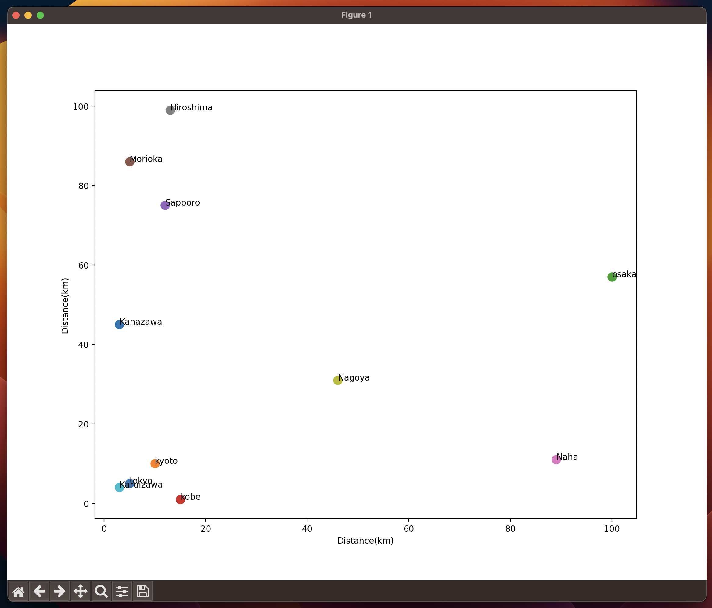

# Quiz 038

## Code
```.py
from matplotlib import pyplot as plt
import random
random.seed(1234)

class coordinate:
    def __init__(self, x, y):
        self.x = x
        self.y = y

    def __repr__(self)->str:
        return f"[Coordinate Object] × x:{self.x}, y:{self.y}"

class city:
    def __init__(self, name:str, location:coordinate):
        self.name = name
        self.location = location

    def __repr__(self)->str:
        return f"[City Object] City {self.name} is located at {self.location}"


    def distance(self, cityB):
        # if isinstance(cityB, city):
        xa, ya = self.location.x, self.location.y
        xb, yb = cityB.location.x, cityB.location.y
        # else:
        #     raise TypeError("Input should be an object of the class city")
        d = ((xa - xb)**2 + (ya-yb)**2 )**(1/2)
        return d


class country:
    def __init__(self, name:str):
        self.name = name
        self.cities = []

    def add_city(self, new_city:city):
        self.cities.append(new_city)

    def __repr__(self)->str:
        return f"[Country Object] Country {self.name} has {len(self.cities)} cities"

point1 = coordinate(x=5, y=5)
tokyo = city(name="tokyo", location=point1)
kyoto = city(name="kyoto", location=coordinate(x=10,y=10))
Japan = country(name="Japan")
Japan.add_city(tokyo)
Japan.add_city(kyoto)

japan_cities = ["osaka", "kobe", "Sapporo", "Morioka", "Naha", "Hiroshima", "Nagoya", "Karuizawa", "Kanazawa"]
for x in japan_cities:
    point = coordinate(x=random.randint(1,100), y=random.randint(1,100))
    Japan.add_city(new_city=city(name=x,location=point))

for city in Japan.cities:
    d = Japan.cities[0].distance(cityB=city)


plt.xlabel("Distance(km)")
plt.ylabel("Distance(km)")
for i in Japan.cities:
    x = i.location.x
    y = i.location.y
    plt.text(x,y,i.name, fontsize=10)
    plt.scatter(x,y, s=100)

plt.show()
```

## result

