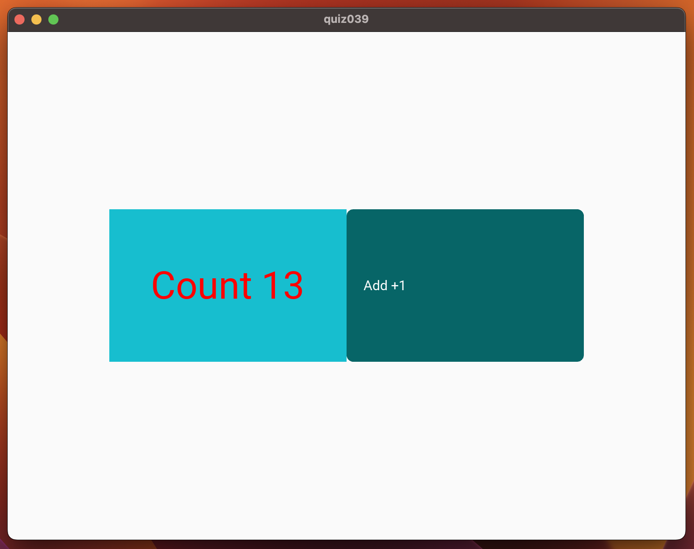

# QUIZ39

## Code
### Python
```.py
from kivymd.app import MDApp

class quiz039(MDApp):
    def __init__(self, **kwargs):
        super().__init__(**kwargs)
        self.count = 0

    def button(self):
        self.count += 1
        self.root.ids.myname.text = f"Count {self.count}"


    def build(self):
        return

test = quiz039()
test.run()
```
### KV
```.py
Screen:
    size: 500, 500


    MDBoxLayout:
        id: background
        orientation: "horizontal"
        size_hint: 0.7, 0.3
        pos_hint: {"center_x":0.5, "center_y":0.5}

        MDLabel:
            id: myname
            size_hint: .5, 1
            text: "Count"
            halign: "center"
            font_size: "34pt"
            color: "red"
            md_bg_color: "#17becf"

        MDChip:
            id: buttonx
            size_hint: .5, 1
            text: "Add +1"
            font_size: "34pt"
            halign: "center"
            md_bg_color: "#076567"
            text_color: "#FFFFFF"
            on_press: app.button()
```

## Result



