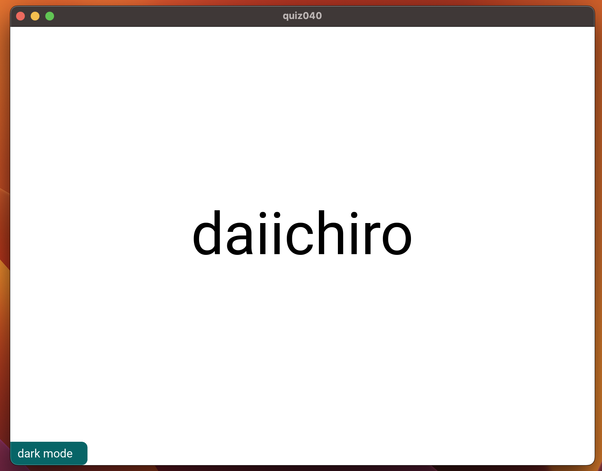
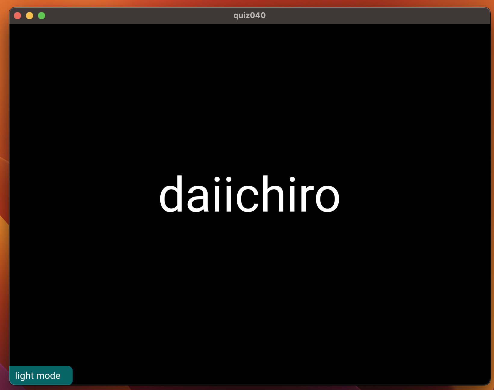

# QUIZ40

## Code
### Python
```.py
from kivymd.app import MDApp

class quiz040(MDApp):

    def button(self):
        if self.root.ids.background.md_bg_color == [1.0, 1.0, 1.0, 1.0]:
            self.root.ids.background.md_bg_color = "#000000"
            self.root.ids.myname.color = "white"
            self.root.ids.buttonx.text = "light mode"
        else:
            self.root.ids.background.md_bg_color = "#FFFFFF"
            self.root.ids.myname.color = "black"
            self.root.ids.buttonx.text = "dark mode"

    def build(self):
        return

test = quiz040()
test.run()
```
### KV
```.py
Screen:
    size: 500, 500


    MDBoxLayout:
        id: background
        orientation: "vertical"
        size_hint: 1, 1
        pos_hint: {"center_x":0.5, "center_y":0.5}
        md_bg_color: "#FFFFFF"

        MDLabel:
            id: myname
            text: "daiichiro"
            halign: "center"
            font_size: "60pt"
            pos_hint: {'center_x': 0.5, 'center_y': 0.5}
            color: "black"

        MDChip:
            id: buttonx
            text: "dark mode"
            md_bg_color: "#076567"
            text_color: "#FFFFFF"
            on_release: app.button()
            pos_hint:{"center_x":0.06,"center_y":.1}
```

## Result


