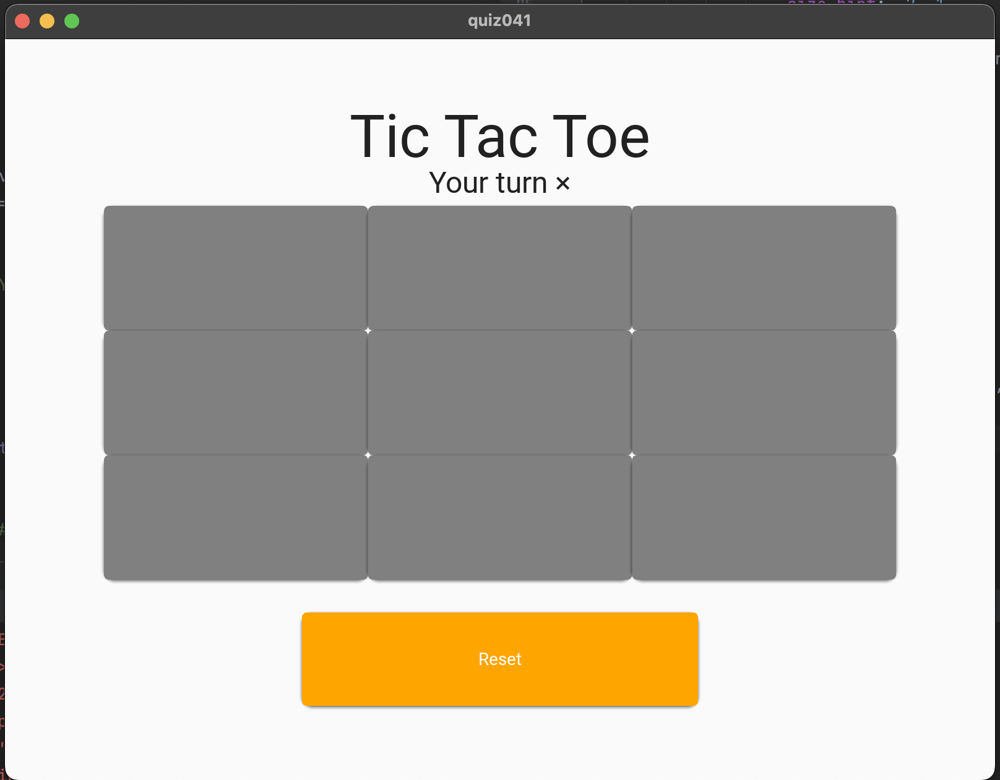
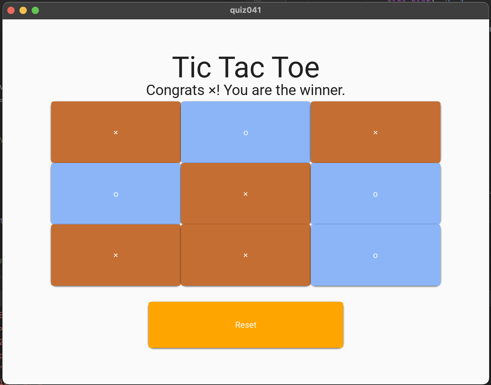

# Quiz 41

## The code
### python
```.py
from kivymd.app import MDApp


class quiz041(MDApp):

    def __init__(self, **kwargs):
        super().__init__(**kwargs)
        self.values = [0,0,0,0,0,0,0,0,0]
        self.player = "×"


    def button(self,button_id):
        player = self.player
        x = "self.root.ids.button" + button_id
        button = eval(x)

        if self.values[int(button_id)-1] == 0:
            button.text = player
            if player == "×":
                self.player = "o"
                button.md_bg_color = "#c56e33"
                self.values[int(button_id)-1] = 1
            else:
                self.player = "×"
                button.md_bg_color = "#8bb5f7"
                self.values[int(button_id)-1] = 2

        win_combo = [(0, 1, 2), (3, 4, 5), (6, 7, 8),
                     (0, 3, 6), (1, 4, 7), (2, 5, 8),
                     (0, 4, 8), (2, 4, 6)]

        for y in win_combo:
            if all(self.values[i] == self.values[y[0]] and self.values[i] != 0 for i in y):
                self.root.ids.label2.text = f"Congrats {player}! You are the winner."
                break
        else:
            self.root.ids.label2.text = f"Your turn {self.player}"

    def reset(self):
        self.values = [0,0,0,0,0,0,0,0,0]
        self.player = "×"
        for x in range(1, 10):
            y = "self.root.ids.button" + str(x)
            current_button = eval(y)
            current_button.text = ""
            current_button.md_bg_color = "#a5a6a6"
        self.root.ids.label2.text = f"Your turn {self.player}"


    def build(self):
        return


test = quiz041()
test.run()
```

### Kyvymd
```.kv
MDScreen:
    MDBoxLayout:
        size_hint: .8, .8
        orientation: 'vertical'
        pos_hint: {'center_x': .5, 'center_y': .5}
        MDBoxLayout:
            id: box1
            size_hint: 1, .2
            orientation: 'vertical'
            MDLabel:
                text: 'Tic Tac Toe'
                halign: 'center'
                font_style: 'H3'
            MDLabel:
                id: label2
                text: "Your turn " + app.player
                halign: 'center'
                font_style: 'H5'

        MDBoxLayout:
            size_hint: 1, .8
            orientation: 'vertical'
            pos_hint: {'center_x': .5, 'center_y': .5}
            MDBoxLayout:
                size_hint:1,.33
                orientation:"horizontal"
                MDRaisedButton:
                    id: button1
                    text: ""
                    size_hint: .2, 1
                    md_bg_color: "grey"
                    on_release: app.button("1")
                MDRaisedButton:
                    id: button2
                    text: ""
                    size_hint: .2, 1
                    md_bg_color: "grey"
                    on_release: app.button("2")
                MDRaisedButton:
                    id: button3
                    text: ""
                    size_hint: .2, 1
                    md_bg_color: "grey"
                    on_release: app.button("3")
            MDBoxLayout:
                size_hint:1,.33
                orientation:"horizontal"
                MDRaisedButton:
                    id: button4
                    text: ""
                    size_hint: .2, 1
                    md_bg_color: "grey"
                    on_release: app.button("4")
                MDRaisedButton:
                    id: button5
                    text: ""
                    size_hint: .2, 1
                    md_bg_color: "grey"
                    on_release: app.button("5")
                MDRaisedButton:
                    id: button6
                    text: ""
                    size_hint: .2, 1
                    md_bg_color: "grey"
                    on_release: app.button("6")

            MDBoxLayout:
                size_hint:1,.33
                orientation:"horizontal"
                MDRaisedButton:
                    id: button7
                    text: ""
                    size_hint: .2, 1
                    md_bg_color: "grey"
                    on_release: app.button("7")
                MDRaisedButton:
                    id: button8
                    text: ""
                    size_hint: .2, 1
                    md_bg_color: "grey"
                    on_release: app.button("8")
                MDRaisedButton:
                    id: button9
                    text: ""
                    size_hint: .2, 1
                    md_bg_color: "grey"
                    on_release: app.button("9")

        MDLabel:
            size_hint: 1, .07
        MDBoxLayout:
            id: reset
            size_hint: 1, .2
            orientation: 'vertical'
            MDRaisedButton:
                id: resetbutton
                text: "Reset"
                size_hint: .5, .75
                pos_hint: {'center_x': .5, 'center_y': .5}
                on_release: app.reset()
                md_bg_color: "orange"

```

## The evidence


