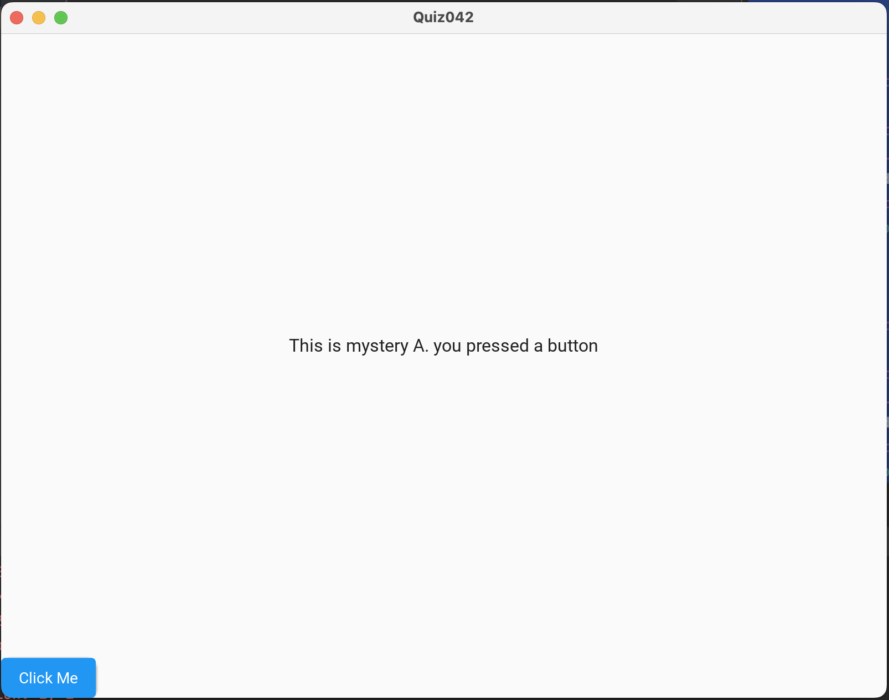

# Quiz42

## Code
### Python
```.py
from kivymd.app import MDApp
from kivymd.uix.screen import MDScreen


class MysteryA(MDScreen):
    pass

class MysteryB(MDScreen):
    pass

class Quiz042(MDApp):
    def build(self):
        return


test = Quiz042()
test.run()
```

### KyvyMD
```.kv
ScreenManager:
    MysteryA:
        name: "MysteryA"
    MysteryB:
        name: "MysteryB"

<MysteryA>:
    MDBoxLayout:
        orientation: "vertical"
        MDLabel:
            text: "This is mystery A. you pressed a button"
            halign: "center"
        MDRaisedButton:
            text: "Click Me"
            on_press: app.root.current = "MysteryB"

<MysteryB>:
    MDBoxLayout:
        orientation: "vertical"
        MDLabel:
            text: "This is mystery B. you pressed a button"
            halign: "center"
        MDRaisedButton:
            text: "Click Me"
            on_press: app.root.current = "MysteryA"
```

## Result



