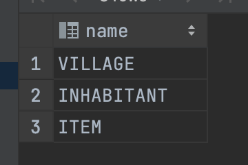
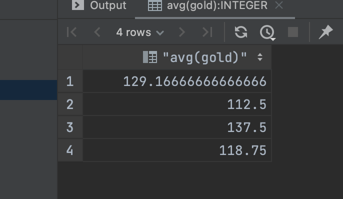
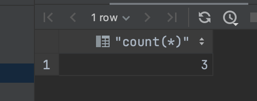
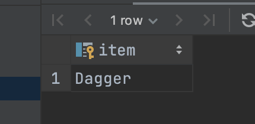

# Quiz44

## Code
```.py
#Q1
SELECT name from sqlite_master where type = "table";

#Q2
select count(*) from INHABITANT where gender = "Male" and state = "Friendly";

#Q3
select avg(gold) from INHABITANT group by villageid;

#Q4
select count(*) from ITEM where item like "A%";

#Q5
select count(distinct job) from INHABITANT;

#Q6
select item from ITEM, INHABITANT where INHABITANT.personid = ITEM.owner and INHABITANT.job = "Herbalist";
```

## Proof






