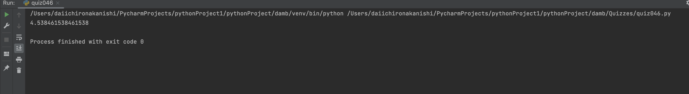

# Quiz46

## Code
```.py
import sqlite3

class database_handler:
    def __init__(self,dbname):
        self.connection = sqlite3.connect(dbname)
        self.cursor = self.connection.cursor()

    def create_table(self):
        query = f"""CREATE TABLE if not exists words(
    id INTEGER PRIMARY KEY AUTOINCREMENT,
    word TEXT NOT NULL,
    length INTEGER NOT NULL)"""
        self.run_query(query)

    def run_query(self, query):
        self.cursor.execute(query)
        self.connection.commit()

    def close(self):
        self.connection.close()

db = database_handler("Quiz046.db")
db.create_table()

haiku = """Code flows like a stream
Algorithms guide its way
In silence, it solves"""

for i in haiku.split():
       query = f"""INSERT into words (word, length) VALUES('{i}', {len(i)})"""
       db.run_query(query)

query = f"""select avg(length) from words"""
db.run_query(query)

db.close()

length = []
for i in haiku.split():
    length.append(len(i))
print(sum(length)/len(length))
```

## Proof


