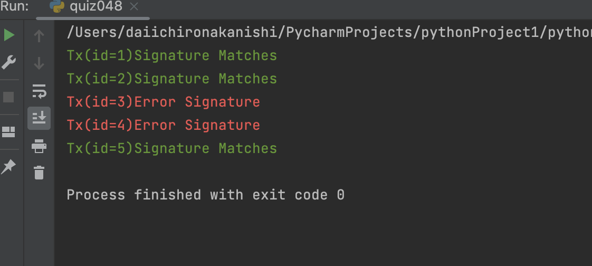

# Quiz48

## Code
```.py
from sqlalchemy.orm import declarative_base
from sqlalchemy import Column, Integer, String, create_engine
from sqlalchemy.orm import sessionmaker
from secure_password import check_password

x = declarative_base()

class ledger(x):
    __tablename__ = 'ledger'
    id = Column(Integer, primary_key=True)
    sender_id = Column(Integer, nullable=False)
    receiver_id = Column(Integer, nullable=False)
    amount = Column(Integer, nullable=False)
    signature = Column(String, nullable=False)

y = create_engine(f"sqlite:///bitcoin_exchange (1).db")
z = sessionmaker(bind=y)
a = z()
res = a.query(ledger).all()


red = "\33[0;31m"
green = "\33[0;32m"
end = "\33[0m"

for i in res:
    nothashed = f"id {i.id},sender_id {i.sender_id},receiver_id {i.receiver_id},amount {i.amount}"
    if check_password(i.signature, nothashed):
        print(f"{green}Tx(id={i.id})Signature Matches{end}")
    else:
        print(f"{red}Tx(id={i.id})Error Signature{end}")

```

## Proof

