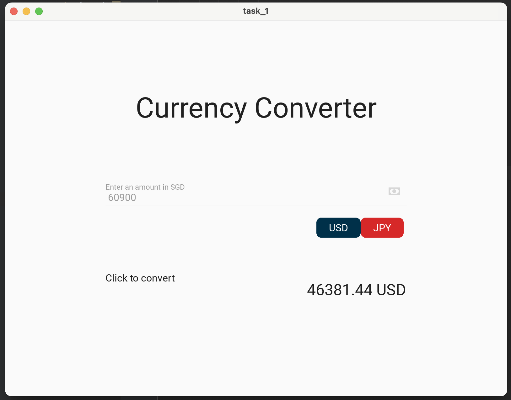
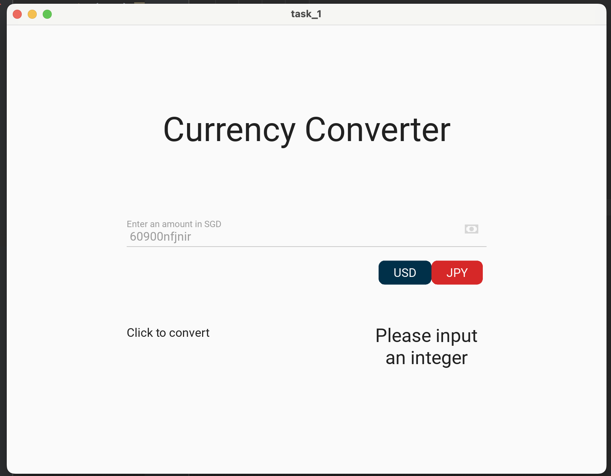

# GUI Building Task
## Task1: Currency Conversion
### python code
```.py
from kivymd.app import MDApp

class task_1(MDApp):
    def build(self):
        return

    def usdjpycvt(self, choice:str):
        number = self.root.ids.my_price.text
        number = number.replace(' ', '')
        if number.isdigit():
            if 'USD' in choice:
                self.count = round(int(number) * 0.7616, 2)
                self.root.ids.result.text = f"{self.count} USD"
            elif 'JPY' in choice:
                self.count = round(int(number) * 99.2754, 2)
                self.root.ids.result.text = f"{self.count} JPY"
        else:
            self.root.ids.result.text = "Please input an integer"


test = task_1()
test.run()
```

### KV Code
```.py
Screen:
    size: 500, 500

    MDBoxLayout:
        orientation: "vertical"
        size_hint: 0.6, 0.8
        pos_hint: {"center_x":0.5, "center_y":0.55}

        MDLabel:
            id: my_title
            text: "Currency Converter"
            halign: "center"
            font_size: "34pt"
            pos_hint: {'center_x': 0.5, 'center_y': 0.1}


        MDTextField:
            id: my_price
            hint_text: 'Enter an amount in SGD'
            icon_right: 'cash'
            icon_right_color: app.theme_cls.primary_color
            pos_hint: {'center_x': 0.5, 'center_y': 0.1}
            width: 1400

        MDBoxLayout:
            orientation: "horizontal"
            size_hint: 1, 0.9
            pos_hint: {"center_x":0.5, "center_y":0.1}

            MDLabel:
                id: my_click
                text: "Click to convert"
                font_size: "12pt"
                pos_hint: {'center_x': 0.3, 'center_y': 0.5}

            MDBoxLayout:
                orientation: "vertical"
                size_hint: 0.5, 1
                pos_hint: {"center_x": 1, "center_y":0.8}

                MDBoxLayout:
                    orientation: "horizontal"
                    size_hint: 1, 3
                    pos_hint: {"center_x":0.6, "center_y":0.4}

                    MDChip:
                        text: "USD"
                        md_bg_color: "#003049"
                        text_color: "#FFFFFF"
                        on_press: app.usdjpycvt("USD")
                        pos_hint:{"center_x":.6,"center_y":.5}

                    MDChip:
                        text: "JPY"
                        md_bg_color: "#D62828"
                        text_color: "#FFFFFF"
                        on_press: app.usdjpycvt("JPY")
                        pos_hint:{"center_x":.3,"center_y":.5}


                MDLabel:
                    id: result
                    font_size: 50
                    size_hint: 1, .8
                    halign: "center"
                    pos_hint:{"center_x":.5,"center_y":0}
```

## Screenshot of result
### Success case

### Failure case

